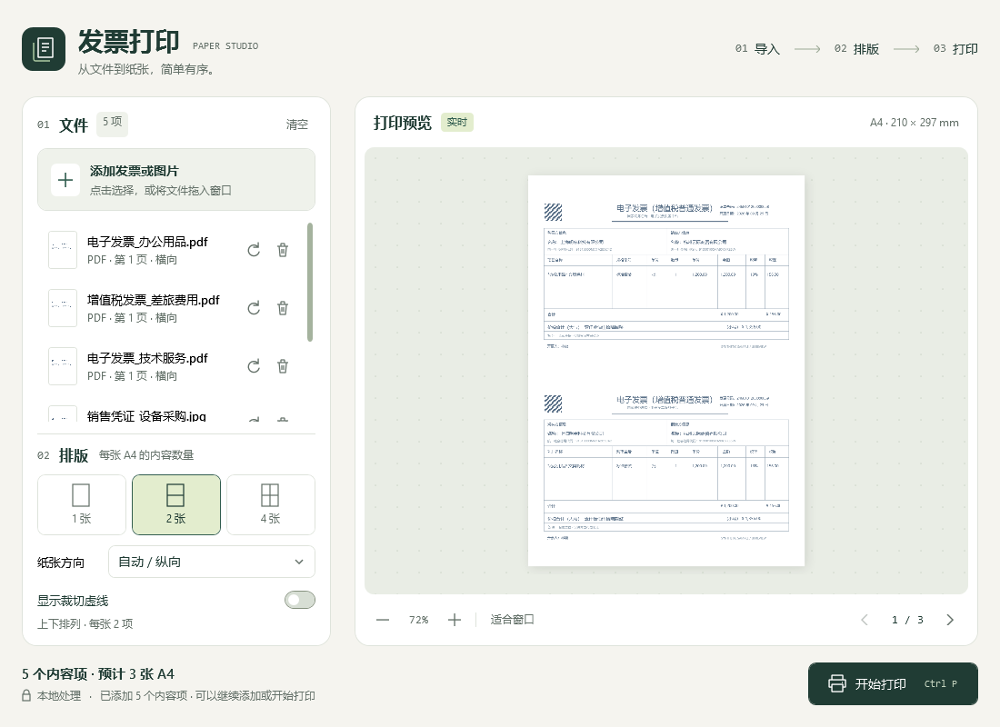
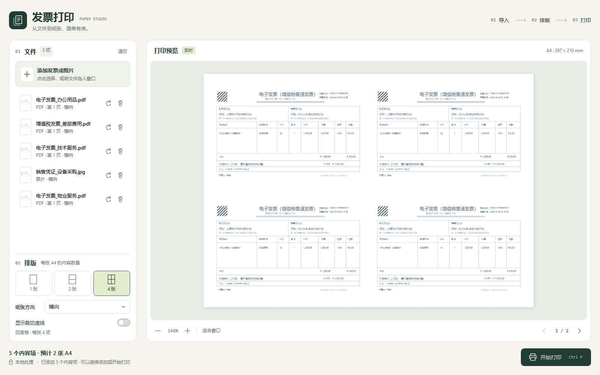

# InvoicePrinting · 发票打印

一个基于 C#、.NET 10 和 WPF 的 Windows 桌面工具。将 PDF 发票或图片添加到同一个任务中，选择每张 A4 放置 1、2 或 4 项，检查预览后通过 Windows 打印对话框输出。vide coding开发。

文件在本机解析，应用不上传原文件，也不修改原文件。

## 应用截图

以下截图使用模拟发票数据，展示应用的排版设置和打印预览。

### 纵向 A4 · 每页 2 项



### 横向 A4 · 每页 4 项



## 功能

- 批量选择或拖入文件，并可继续追加到当前任务。
- 多页 PDF 按页拆成独立内容项，可与图片混合排版。
- A4 每页 1 项、2 项或 4 项，按列表顺序分页，保持内容比例并居中适配。
- 纵向 A4 的双格布局为上下排列，横向 A4 的双格布局为左右排列；四格布局为 2 × 2。
- 按内容和单元格的长边自动匹配方向，支持单项顺时针旋转 90°，缩略图同步更新。
- 实时预览、翻页、适合窗口以及 20%–300% 缩放。
- 可选中间裁切虚线，同时用于预览和打印。
- 移除单项、清空任务、键盘快捷键和导入状态提示。
- 通过 Windows 打印对话框选择打印机，按当前排版提交 A4 打印任务。

## 支持的文件

| 格式 | 当前处理方式 |
| --- | --- |
| PDF | 导入全部页面，每页对应一个内容项 |
| PNG、JPG / JPEG、BMP | 每个文件对应一个图片内容项 |
| TIF / TIFF | 读取首帧；多页 TIFF 当前不会逐页展开 |
| WEBP | 接受该扩展名，能否解码取决于本机可用的 Windows / WPF 图像解码器 |

## 环境要求

- **运行单文件发布版**：Windows x64，系统版本需满足 [.NET 10 的 Windows 支持要求](https://learn.microsoft.com/en-us/dotnet/core/install/windows#supported-versions)。建议使用受支持的 Windows 11 版本。
- **从源码运行或发布**：安装 [.NET 10 SDK](https://dotnet.microsoft.com/download/dotnet/10.0) 的 Windows x64 版本，首次还原包需要访问 NuGet。
- **打印**：安装并配置 Windows 打印机及驱动，也可选择系统中的虚拟打印机。

当前内置 PDFium 是 x64 组件，请使用 x64 进程。项目采用 WPF，当前没有 macOS、Linux、x86 或原生 ARM64 发布配置。

## 从源码启动

下载或克隆源码后，在仓库根目录打开 PowerShell：

```powershell
dotnet restore src/InvoicePrinting/InvoicePrinting.csproj -r win-x64
dotnet run --project src/InvoicePrinting/InvoicePrinting.csproj -r win-x64
```

可用 `dotnet --info` 确认 SDK 和运行时架构。若使用 Visual Studio，请安装支持 .NET 10 的版本及“.NET 桌面开发”工作负载，然后打开 `InvoicePrinting.slnx`。

## 使用方法

1. 点击“添加发票或图片”，或将一个或多个文件拖入窗口。PDF 会按原始页序展开到列表中。
2. 选择每张 A4 的内容数量和纸张方向。“自动 / 纵向”当前使用纵向 A4，内容会根据单元格方向自动旋转。
3. 在文件列表中按需旋转或删除内容项。点击列表项会跳转到它所在的预览页。
4. 检查预览，可用鼠标滚轮、缩放按钮或“适合窗口”调整显示比例；预览缩放不会改变打印尺寸。
5. 如需裁切指引，勾选“显示裁切虚线”。双格页面有 2 项时绘制一条中间虚线，四格页面有 4 项时绘制十字虚线；单项页面和未填满的四格页面不绘制。
6. 点击“开始打印”，选择打印机并确认。程序会使用当前纸张方向和 A4 纸张提交全部排版页。

预览和打印共用 `LayoutEngine` 计算排版。纸面结果仍受打印机可打印区域、驱动设置和纸张装载影响；正式批量打印前建议先打印一张确认位置和清晰度。

## 快捷键

| 操作 | 快捷键 |
| --- | --- |
| 添加文件 | `Ctrl+O` |
| 打印 | `Ctrl+P` |
| 预览适合窗口 | `Ctrl+0`，支持小键盘 `0` |
| 删除选中的内容项 | `Delete` |
| 放大 / 缩小预览 | 在预览区域滚动鼠标滚轮 |

## 发布 Windows x64 单文件 EXE

在仓库根目录执行：

```powershell
dotnet publish src/InvoicePrinting/InvoicePrinting.csproj -p:PublishProfile=win-x64-single-file
```

输出位置：

```text
artifacts\single-file\InvoicePrinting.exe
```

发布配置采用 `Release`、`win-x64`、自包含运行时和单文件压缩。生成的 EXE 包含 .NET 运行时和 PDFium，无需用户另外安装 .NET 或手动放置 PDFium DLL。

发布目录还包含 `LICENSE`、`LICENSE.zh-CN`、`NOTICE`、`THIRD-PARTY-NOTICES.txt`、`DISTRIBUTION-TERMS.txt` 和 `licenses/`。分发发布版时，请保留这些随附文件；应用程序本体仍为单文件 EXE。

单文件程序运行时会解压所需原生组件。PDFium 首次使用时会写入当前用户临时目录下的 `InvoicePrinting\pdfium\x64\pdfium.dll`，因此运行环境需要允许写入临时目录。

## 当前限制

- PDF 导入时以 144 DPI 栅格化，预览和打印使用同一份位图；打印结果不保留原 PDF 的矢量文字。较小文字或大幅放大时应检查清晰度。
- 不提供受密码保护 PDF 的密码输入界面。
- TIFF 仅导入首帧；若需打印其余页面，请先拆成独立图片或转换为 PDF。
- 任务按导入顺序排版，当前没有拖动排序、复制内容项、任务保存或设置持久化功能。
- 当前没有独立的 PDF 导出按钮。若 Windows 中已安装“Microsoft Print to PDF”，可在打印对话框中选择它保存打印结果。
- 边距和单元格间距采用内置设置，当前没有自定义入口，也不会按打印机的不可打印区域自动调整。
- 大量 PDF 页面或高分辨率图片会占用较多内存。若某个文件无法解析，该次导入会提示失败，请单独检查文件后再添加。

## 源码结构

```text
InvoicePrinting/
├─ README.md                                  使用说明与项目入口
├─ CONTRIBUTING.md                            开发、验证和提交指南
├─ InvoicePrinting.slnx                       按 src、tests 分组的解决方案
├─ Directory.Build.props                      统一构建输出目录
├─ .gitignore                                 本地生成文件与私密配置的忽略规则
├─ .gitattributes                             文本换行与许可证原文保留规则
├─ src/
│  └─ InvoicePrinting/                        WPF 应用项目
│     ├─ InvoicePrinting.csproj               目标框架及 NuGet 引用
│     ├─ App.xaml                             应用资源、样式与启动窗口配置
│     ├─ App.xaml.cs                          WPF 应用类
│     ├─ AssemblyInfo.cs                      WPF 主题资源查找配置
│     ├─ MainWindow.xaml                      文件列表、排版设置和预览界面
│     ├─ MainWindow.xaml.cs                   导入交互、预览、快捷键和打印
│     ├─ Models/
│     │  ├─ ContentItem.cs                    导入内容项及旋转状态
│     │  └─ LayoutModels.cs                   A4 网格、分页与布局计算
│     ├─ Services/
│     │  ├─ DocumentImporter.cs               PDF / 图片导入
│     │  └─ PdfiumBootstrapper.cs             PDFium 原生组件加载
│     └─ Properties/
│        └─ PublishProfiles/
│           └─ win-x64-single-file.pubxml     Windows x64 单文件发布配置
├─ tests/
│  └─ InvoicePrinting.Smoke/                  验证项目
│     ├─ InvoicePrinting.Smoke.csproj         验证项目配置及应用项目引用
│     ├─ Program.cs                          导入与布局验证入口
│     ├─ VisualReview.cs                     离屏界面验证与截图生成
│     └─ README.md                           验证命令及覆盖范围
├─ tools/
│  └─ licensing/                             许可资料核验工具
│     ├─ verify-licenses.py                  许可文件、来源及发布副本核验
│     ├─ original-license-hashes.json         第三方许可原文哈希基线
│     └─ README.md                           工具使用说明
├─ docs/
│  ├─ README.md                              文档索引与文件存放约定
│  ├─ design/
│  │  └─ 产品设计文档.md                      产品规划及后续功能记录
│  └─ screenshots/                           README 使用的模拟数据截图
│     ├─ portrait-two-items.png              纵向 A4 双格预览
│     └─ landscape-four-items.png            横向 A4 四格预览
├─ licenses/                                 第三方许可证原文、译文及来源
├─ LICENSE                                   Apache-2.0 正式原文
├─ LICENSE.zh-CN                             项目许可证中文参考译文
├─ NOTICE                                    项目与第三方署名声明
├─ THIRD-PARTY-NOTICES.txt                    第三方组件说明
├─ DISTRIBUTION-TERMS.txt                     发布资料的随附文件说明
└─ artifacts/                                本地生成及归档内容，不纳入源码管理
   ├─ bin/                                   当前构建的二进制输出
   ├─ obj/                                   当前构建的中间文件
   ├─ single-file/                           Windows x64 单文件发布输出
   └─ legacy-cache/
      └─ root-project/                       旧根目录构建缓存归档
         ├─ bin/
         └─ obj/
```

[产品设计文档](docs/design/产品设计文档.md)包含规划中的能力；当前可用功能以本 README 和源码实现为准。文档与目录存放约定见[文档索引](docs/README.md)。

`InvoicePrinting.slnx` 按 `src` 和 `tests` 分组，分别包含应用项目和验证项目。构建的二进制文件和中间文件集中在 `artifacts/bin/` 和 `artifacts/obj/`，发布版位于 `artifacts/single-file/`。旧根目录的 `bin/`、`obj/` 内容保留在 `artifacts/legacy-cache/root-project/`，归档不参与当前构建。`artifacts/` 存放本地生成或归档的内容，不纳入源码管理。

## 技术栈与第三方组件

感谢以下项目提供桌面界面、PDF 解析和渲染能力。直接 NuGet 引用及版本以[应用项目文件](src/InvoicePrinting/InvoicePrinting.csproj)为准。

| 项目 / 包 | 当前版本 | 用途 | 上游与包信息 |
| --- | --- | --- | --- |
| .NET / WPF | .NET 10，目标 `net10.0-windows` | Windows 桌面界面、图像处理与打印 | [.NET](https://github.com/dotnet/runtime)、[WPF](https://github.com/dotnet/wpf) |
| PdfiumViewer | 2.13.0 | PDF 页面读取、尺寸获取及位图渲染 | [源码](https://github.com/pvginkel/PdfiumViewer)、[NuGet](https://www.nuget.org/packages/PdfiumViewer/2.13.0) |
| PdfiumViewer.Native.x86_64.v8-xfa | 2018.4.8.256 | x64 PDFium 原生渲染组件 | [构建项目](https://github.com/pvginkel/PdfiumBuild)、[NuGet](https://www.nuget.org/packages/PdfiumViewer.Native.x86_64.v8-xfa/2018.4.8.256) |

原生组件基于 [PDFium](https://pdfium.googlesource.com/pdfium/) 构建。表中的 `2018.4.8.256` 是原生 NuGet 包版本。

## 反馈与贡献

欢迎通过 GitHub 问题区（Issues）反馈问题或通过合并请求（Pull Request）提交改进。报告导入或打印问题时，请说明 Windows 版本、程序运行方式、文件格式、版式、纸张方向及打印机型号；如需附样例，优先使用不含个人或财务敏感信息的文件。

开发及提交要求见 [贡献指南](CONTRIBUTING.md)。

## 许可证

项目原始代码和文档采用 Apache 许可证 2.0 版（Apache-2.0），详见[完整中文参考译文](LICENSE.zh-CN)和[英文正式条款](LICENSE)。第三方组件保留各自的许可证，组件说明、原文及中文译文见[第三方声明](THIRD-PARTY-NOTICES.txt)及[许可证资料目录](licenses/)。
